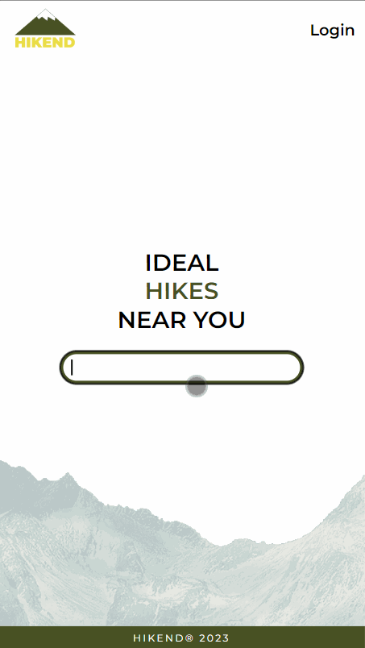
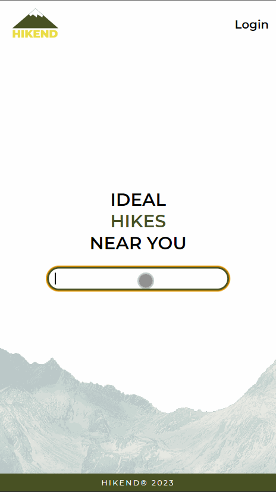
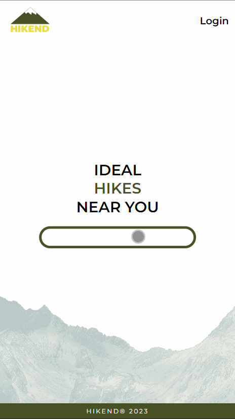

<h1>Hikend 🌄</h1>

<h2>Project Overview</h2>

 
Inspired by my passion for hiking, with the creation of this web application I intended to conveniently allow anybody interested in spending time in nature to find a place that is near their point of interest. 
 
<h2>Technologies</h2>

For this project, the following technologies were used:

<ul>
    <li>
Angular - The framework chosen for this project due to its ability to create and easily work with a component based architecture.
</li>

   <li>
Leaflet - Open source JavaScript library used for displaying maps.
</li>
</ul>
<h2>Application flow</h2>
Once the web page is opened, the user is greeted with a search bar where they enter the name of the city.

Upon selecting, they will be redirected to a page where all the mountains related to that city are displayed on a map by default or the user has the option to display them in a list view. 
 
The user has the ability to filter the displayed list, as well as sort it by alphabetical ascending (default) order or in a alphabetical descending order, as well as closest and furthest from the city, in real time. 
 
 

 
Once a mountain is selected, the user will be redirected to the selected mountain page. There he will be able to find useful information such as:
  <ul>
    <li>Mountain peak</li>
    <li>Mountain height</li>
    <li>Description</li>
    <li>Local hiking clubs</li>
    <li>Map with a pin shwoing the location of the mountain peak</li>
    <li>Available routes, their description and ability to download a .GPX file for offline navigation</li>
  </ul>
 

At the top of the single mountain page the user, if logged in, has the ability to favorite or save a mountain they find interesting. To see the list of all favorited mountains the user can click on the "Saved" navigation link in the header which will take them to a seperate page where all of the mountains, from different cites will be listed. As the mountains are related to different cites, the user loses the ability to sort by "Closest" and "Furthest".
 
 

 
<h2>Design</h2>

Colors chosen for the design of the project were intended to associate the user with nature, in the case of the color green, and happines and adventure, which is the case with the yellow color.

The colors chosen were the following:

<ul>
    <li>🟨 Yellow (#EADD46)</li>
    <li>🟩 Green (#485123)</li>
</ul>
